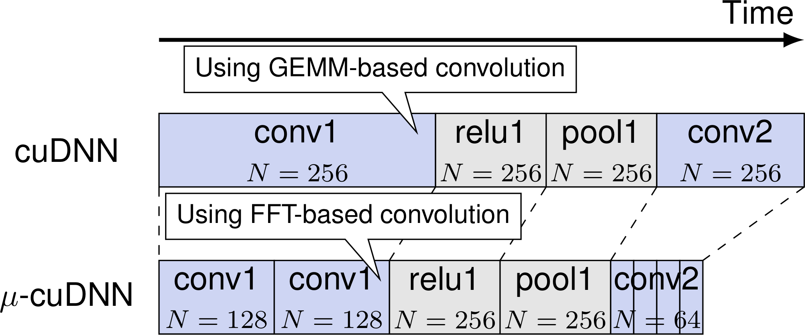
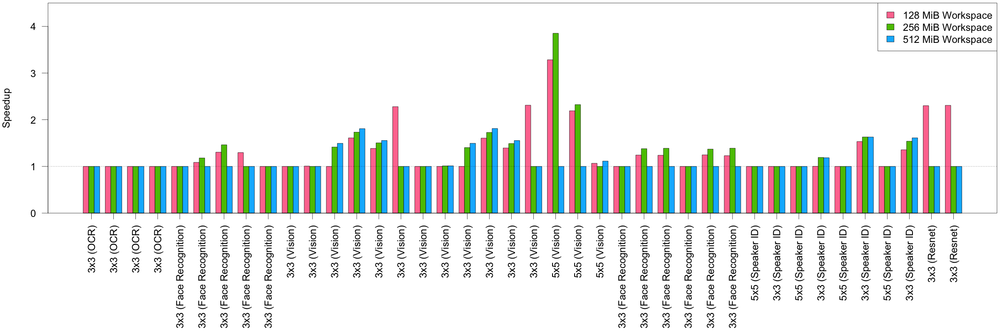
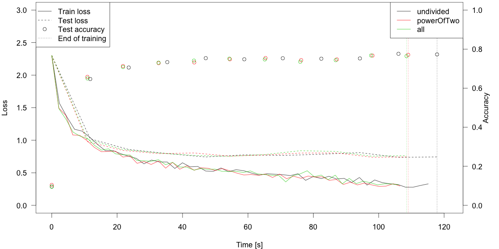

# &mu;-cuDNN



&mu;-cuDNN is a transparent wrapper for the [NVIDIA cuDNN](https://developer.nvidia.com/cudnn) library that splits a minibatch into micro-batches to speed up computation.
&mu;-cuDNN is intended to be combined with deep learning frameworks written in C++, such as [Caffe](https://github.com/BVLC/caffe) and [TensorFlow](https://github.com/tensorflow/tensorflow).

## Reference
This repository contains the code used in
> Yosuke Oyama, Tal Ben-Nun, Torsten Hoefler, Satoshi Matsuoka, &mu;-cuDNN: Accelerating Deep Neural Networks with Micro-Batching, arXiv e-prints, 2018. \[[URL](https://arxiv.org/abs/1804.04806)\]

Please cite as:
```
@article{ucudnn,
  author    = {Yosuke Oyama and Tal Ben-Nun and Torsten Hoefler and Satoshi Matsuoka},
  title     = {{{\(\mu\)}-cuDNN}: Accelerating Deep Learning Frameworks with Micro-Batching},
  journal   = {CoRR},
  volume    = {abs/1804.04806},
  year      = {2018},
  url       = {http://arxiv.org/abs/1804.04806},
  archivePrefix = {arXiv},
  eprint    = {1804.04806},
}
```

## Requirements
* GCC >= 4.8.5 (should support `-std=c++11`)
* [CMake](https://cmake.org/) >= 3.9.2
* [CUDA](https://developer.nvidia.com/cuda-downloads) >= 8
* [cuDNN](https://developer.nvidia.com/cudnn) >= 6
* [GLPK](https://www.gnu.org/software/glpk/#downloading) >= 4.63 (optional)
* [SQLite](https://www.sqlite.org/download.html) >= 3.21 (optional)

## Performance
### DeepBench


This figure shows the relative speedups of [DeepBench](https://github.com/baidu-research/DeepBench)'s 3x3 and 5x5 convolution layers on the [NVIDIA Tesla P100-SXM2](https://www.nvidia.com/en-us/data-center/tesla-p100/) GPU.
We use a mini-batch of 256, and workspace limits of 128, 256, and 512 MiB.
&mu;-cuDNN achieves up to speedups of 2.31x for 3x3 layers and 3.85x for 5x5 layers.

### CIFAR-10 Training


This figure shows learning curves of [a CIFAR-10 CNN defined in Caffe](https://github.com/BVLC/caffe/tree/master/examples/cifar10) with three different micro-batch policies.
We use a mini-batch of 1024, and workspace limit of 64 MiB.
The CNN achieves ~80% test accuracy that is similar to [the official result](https://github.com/BVLC/caffe/tree/master/examples/cifar10).

## Installation
1. Compile &mu;-cuDNN with [CMake](https://cmake.org/):
```
mkdir build && cd build
cmake .. -DCMAKE_INSTALL_PREFIX:PATH="/path/to/ucudnn"
make
make install
```

2. Add path to &mu;-cuDNN:
```
export CPLUS_INCLUDE_PATH=/path/to/ucudnn/include:$CPLUS_INCLUDE_PATH
export LD_LIBRARY_PATH=/path/to/ucudnn/lib:$LD_LIBRARY_PATH
```

3. Modify your deep learning framework:
   * Add `#include <ucudnn/ucudnn.h>` to `*.cpp`,`*.cu`,`*.h` files that contain `cudnnHandle_t`.
   * Replace `cudnnHandle_t` with `UcudnnHandle_t`.

4. Compile the framework.
   * You need to link `libucudnn.so` to the framework explictly by adding the `-lucudnn` flag.
   * In some frameworks you also need to specify the `-std=c++11` flag.
   * For example, the following CMake flags are needed to compile &mu;-cuDNN-enabled [Caffe](https://github.com/BVLC/caffe):
      * `-DCMAKE_SHARED_LINKER_FLAGS="-lucudnn"`
      * `-DCMAKE_EXE_LINKER_FLAGS="-lucudnn"`
      * `-DCMAKE_CXX_FLAGS="-std=c++11"`

Here you can find &mu;-cuDNN enabled forks of [Caffe](?) and [TensorFlow](?), instead of running steps 3. and 4..

### CMake options

| Option | Default | Description |
|--------|---------|-------------|
| `UCUDNN_USE_GLPK`               | OFF | Use [GNU Linear Programming Kit (GLPK)](https://www.gnu.org/software/glpk/) to run ILP-based optimization. |
| `UCUDNN_USE_SQLITE`             | OFF | Use [SQLite](https://www.sqlite.org/) to cache benchmark result in file systems. |
| `UCUDNN_DEBUG_GLPK_PRINT`       | OFF | Output ILP information after solving (as `glpk_{sol,mip,prob}_(UNIX time)`) to the current directory. The output formats are based on the `glp_print_sol`, `glp_print_mip`, `glp_write_prob` functions of GLPK respectively. |
| `UCUDNN_DEBUG_OUTPUT`           | ON  | Output optimization results to stderr. |
| `UCUDNN_DEBUG_OUTPUT_ENV`       | OFF | Output used environment variables to stderr. |
| `UCUDNN_DEBUG_EQUIVALENCE_TEST` | OFF | Compute normalized L2-distance between output tensors of cuDNN and &mu;-cuDNN to check whether these convolutions are equivalent. |
| `UCUDNN_TEST`                   | ON  | Build tests.   |

* Notes on `UCUDNN_DEBUG_EQUIVALENCE_TEST`:
  * The normalized distance may be larger than zero due to numerical error and nondeterministic behavior of some algorithms.
  * In practice the normalized distance should be less than 1e-6.
  * Since this option computes the distance every time, it considerably slows down the computation. Please turn off if you want to perform practical training/inference.

### Runtime options (environment variables)

| Variable | Acceptable values | Default | Description |
|----------|-------------------|---------|-------------|
| `UCUDNN_BATCH_SIZE_POLICY`       | one of `undivided`,`powerofTwo`,`all` | `powerOfTwo` | &mu;-batch size policy. This can be set by `UcudnnHandle_t::setOptimizerBatchSizePolicy` as well. |
| `UCUDNN_BENCHMARK_DEVICES`       | comma-separated integers (e.g. `0,1,2,3`) or `all` | The current device of the process | GPU device ID(s) that are used for benchmarking in parallel. Note that optimization will be incorrect if different kinds of GPUs are used at the same time. |
| `UCUDNN_DEFAULT_WORKSPACE_LIMIT` | integer | `67108864` (i.e. 64 MiB) | The default workspace limit __in bytes__ for convolutional layers. This is used only if the framework tries to get the workspace size before the workspace limit is provided. |
| `UCUDNN_TOTAL_WORKSPACE_SIZE`    | integer | N/A | If this is set, &mu;-cuDNN will create a static workspace size with the specified size __in bytes__ for ILP-based optimization. Workspace limit passed via conventional cuDNN functions will be ignored. |
| `UCUDNN_DATABASE`                | path    | N/A | If this is set, &mu;-cuDNN will use a SQLite 3 database at the specified path to cache the benchmark results. |
